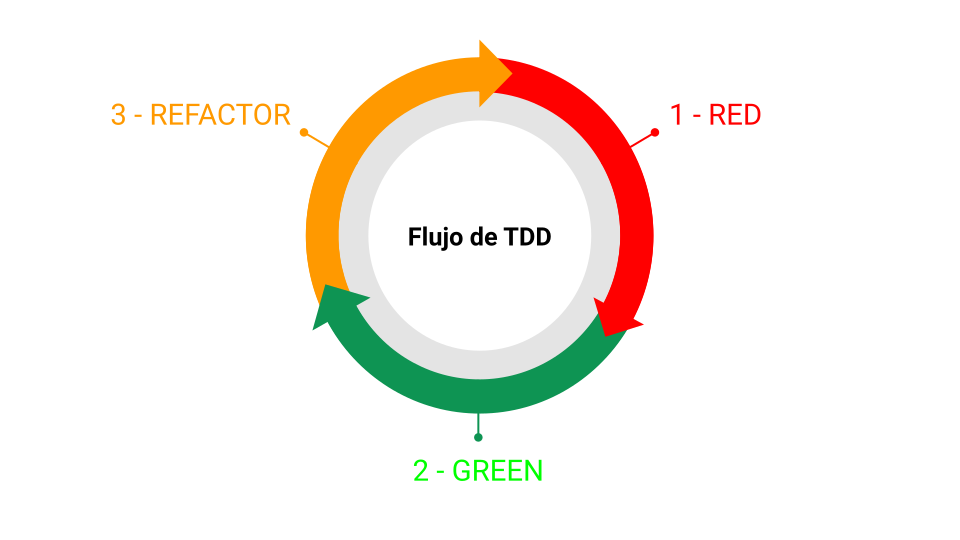
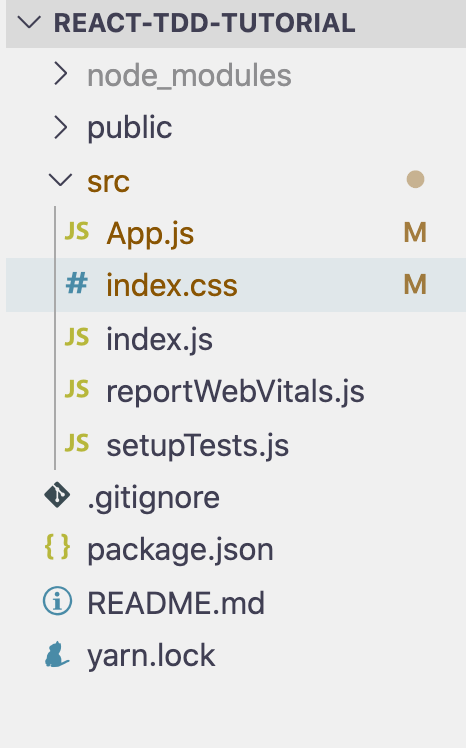

En este post vamos a aprender a cómo crear una app con React JS
aplicando Test Driven Development con Jest y React Testing Library.

Al finalizar este post vas a ser capaz de:

- Comprender las fases de Test Driven Development.
- Aplicar TDD para desarrollar una app en React.
- Hacer Tests a componentes de React usando Jest y React Testing Library.
- Detectar "code smells" en código de React JS.
- Aplicar buenas prácticas de desarrollo en React.
- Hacer pruebas considerando llamadas a una API real.

## Qué es Test Driven Development

Conocido también como TDD por sus siglas en inglés, es una técnica de
desarrollo que consiste en crear código a través de la repetición de un
ciclo llamado Red-Green-Refactor.

En esencia, el proceso es el siguiente:



Donde cada paso significa:

- Crear un test que falle (RED).
- Hacer lo mínimo necesario para que pase el test (GREEN).
- Aplicar code clean y otras buenas prácticas (REFACTOR).

### Beneficios del TDD

Los principales beneficios de aplicar TDD son:

- Crear código que es fácil de testear (al empezar por los tests) -
  Evitar añadir complejidad accidental al crear lo mínimo necesario
  (principio YAGNI)
- Código de **alta calidad.**
- **Seguridad** de que si rompemos una funcionalidad, nuestras
  pruebas nos avisarán y no los usuarios. ¿Quién dijo miedo a hacer
  deploy los viernes?

Sin embargo, es necesario tener cierta experiencia creando tests,
conocer detección de "code smells" y técnicas de refactor.

Esto debido a que no puedes aplicar TDD si no sabes cómo crear un test y
no puedes hacer refactor si no conoces los criterios en base a los qué
basarte.

En este post se asume que ya tienes experiencia con React y Jest, por lo
que no nos dentendremos a explicar los aspectos básicos de esta
tecnología.

## Test Driven Development en componentes de React

Para este tutorial voy a crear una aplicación que consuma una api y
hacer una lista de resultados.

En mi caso, consumiré la api de [citas de los simpson](https://thesimpsonsquoteapi.glitch.me/) pero el mismo principio va a aplicar si consumes otra api diferente.

### Set up del proyecto

Voy a comenzar creando el proyecto usando create react app debido a que
me interesa enfocarme en el desarrollo y no divagar en detalles de
configuración de webpack y babel.

Abro la terminal, me ubico en el lugar donde quiero tener mi app y
ejecuto: `npx create-react-app react-tdd-tutorial`.

Con esto ya viene incluido Jest y React Testing Library, las herramientas de test
que usaremos.

### Estructura de archivos

Ya que voy a hacer una aplicación pequeña que consiste en solamente una
vista, voy a estructurar los archivos de acuerdo a su tipo.

A modo de ejemplo, esta es la estructura que voy a ir generando conforme
avance:

```
src/
  __tests__/
    main-page.test.js
  services/
    index.js
  components/
    main-page.js
  App.js
  index.js
```

Teniendo esto en mente, voy a eliminar los archivos que me da create
react app por default y que no necesito.

Después de removerlos, voy a tener la estructura como muestro a
continuación.



Hago commit y push.

### Cómo empezar con la priemra prueba usando Jest y RTL (RED)

La mejor manera de empezar es haciendo una prueba que me valide si
existe un título o encabezado.

Creo una carpeta `__tests__` y dentro creo un archivo `main-page.test.js`.

Dentro de `main-page.test.js` voy a importar las utilidades de react
testing libray, el componente que voy a testear (aunque aún no exista) y
comenzar con mi primera prueba.

```js
import React from "react"
import { render, screen } from "@testing-library/react"

import { MainPage } from "../components/main-page"

describe("Main Page mount", () => {
  it("must display the main page title", () => {
    render(<MainPage />)
    expect(screen.getByText(/simpsons quotes/i)).toBeInTheDocument()
  })
})
```

**Nota:** Todas las queries de React Testing Library excepto las que inician por "queryBy\*", si no encuentran el elemento lanzarán una excepción en mi test. A pesar de ello, prefiero agregar el `toBeInTheDocument` para que sea más explícita mi intención en el test:

**Segunda nota:** El matcher `toBeInTheDocument` no existe en el core de Jest. Es accesible gracias a lo que tenemos en `src/setupTests.js`.

```js
// jest-dom adds custom jest matchers for asserting on DOM nodes.
// allows you to do things like:
// expect(element).toHaveTextContent(/react/i)
// learn more: https://github.com/testing-library/jest-dom
import "@testing-library/jest-dom"
```

Ahora ejecuto `npm run test` en la terminal y obtengo lo siguiente:

```
 FAIL  src/__tests__/main-page.test.js
  ● Test suite failed to run

    Cannot find module '../components/main-page' from 'src/__tests__/main-page.test.js'

      2 | import { render, screen } from "@testing-library/react";
      3 |
    > 4 | import { MainPage } from "../components/main-page";
        | ^
      5 |
      6 | describe("Main Page mount", () => {
      7 |   it("must display the main page title", () => {

      at Resolver.resolveModule (node_modules/jest-resolve/build/index.js:306:11)
      at Object.<anonymous> (src/__tests__/main-page.test.js:4:1)

Test Suites: 1 failed, 1 total
Tests:       0 total
Snapshots:   0 total
Time:        3.775 s
```

Falla porque no encuentra el archivo de donde importo mi componente. De momento, voy a crear el archivo `main-page.js` con lo mínimo necesario para hacer que el test me de error por mi `expect`.

Creo una carpeta `components` y dentro creo el archivo `main-page.js`.

Dentro, coloco lo siguiente:

```js
// src/components/main-page.js

import React from "react"

export const MainPage = () => <div />
```

Si reviso el test en la consola, ahora tengo el siguiente output:

```
 FAIL  src/__tests__/main-page.test.js
  Main Page mount
    ✕ must display the main page title (35 ms)

  ● Main Page mount › must display the main page title

    TestingLibraryElementError: Unable to find an element with the text: /simpsons quotes/i. This could be because the text is broken up by multiple elements. In this case, you can provide a function for your text matcher to make your matcher more flexible.

    <body>
      <div>
        <div />
      </div>
    </body>

       7 |   it("must display the main page title", () => {
       8 |     render(<MainPage />);
    >  9 |     expect(screen.getByText(/simpsons quotes/i)).toBeInTheDocument();
         |                   ^
      10 |   });
      11 | });
      12 |
```

Con esto ya he completado la primera fase de RED en la que hago un test que falle.

### Hacer que la prueba pase (GREEN)

Ahora voy a hacer que este test pase **implementando lo mínimo necesario**.

En el código de `main-page.js`, coloco lo siguiente:

```js
// src/components/main-page.js

import React from "react"

export const MainPage = () => <h1>Simpsons quotes</h1>
```

Con esto, mi prueba ya está pasando:

```
 PASS  src/__tests__/main-page.test.js
  Main Page mount
    ✓ must display the main page title (36 ms)

Test Suites: 1 passed, 1 total
Tests:       1 passed, 1 total
Snapshots:   0 total
Time:        4.719 s
Ran all test suites related to changed files.
```

La razón por la que hago lo mínimo neceario para que la prueba pase es debido a que quiero mantener mi código sin abstracciones innecesarias ni sobre optimizaciones, un error muy común en los desarrolladores que sobre piensan demasiado las cosas.

Hacer lo mínimo necesario me mantiene enfocado en que mi código tenga justo lo que debe tener, y no hacer optimizaciones HASTA que sea realmente necesario.

### Aplicar el Refactor

El refactor puede ser aplicado tanto en el código del test así como en el código de la implementación.

React Testing Library tiene una query para obtener nodos del DOM de manera más específica de acuerdo a los roles.

Pienso que es mejor cambiar la query que tengo actualmente por una que sea en base al rol de header, de tal modo que mi test pueda seguir pasando exitosamente a pesar de que yo cambie mi implementación por algo diferente a un tag de h1.

```js
describe("Main Page mount", () => {
  it("must display the main page title", () => {
    render(<MainPage />)
    expect(
      screen.getByRole("heading", { name: /simpsons quotes/i })
    ).toBeInTheDocument()
  })
})
```

Guardo el cambio y verifico que esta prueba siga pasando.

Como demostración de que este test es resiliente al cambio, voy a modificar `main-page.js` con lo siguiente:

```js
import React from "react"

export const MainPage = () => (
  <div aria-level="1" role="heading">
    Simpsons quotes
  </div>
)
```

y mi prueba está igualmente pasando.

Voy a regresar mi implementación como la tenía antes con el `h1` porque ese cambio fue sólo como demostración.

Agrego los cambios a Git y hago commit.

Podrías estar pensando: _¿Y este test tan simple de qué me sirve?_

La respuesta a esa pregunta es:

- Validamos que este componente no ocasione un error al momento de hacer el build.
- Validamos que al montarse el componente en el navegador, no genere un throw exception.

El simple hecho de tener estas dos ventajas ya nos pone muy por delante en la calidad del proyecto.

Te sorprenderías de la cantidad de proyectos en los que no tienen esto cubierto.

### Aplicar el flujo de TDD en un listado de elementos

Ahora que ya tienes una idea de cómo es aplicar TDD en una app de React, voy a ir más rápido en terminar esta aplicación.

Voy a aplicar una técnica llamada `fake it until you make it` que consiste en crear pruebas que pasen a pesar de que mi implementación use datos "hardcodeados" o información falsa e iré iterando hasta terminar mi implementación real terminada.

Primero haré una prueba para verificar que exista una lista con tres citas de los simpson, incluyendo detalles de datos que deben contener cada una (RED).

Luego voy a hacer que la prueba pase implementando dicha lista pero de manera "hardcodeada" con JSX (GREEN).

En este punto haré refactors menores en caso de detectarlos.

Después de esto voy a crear un `mock server` en mi prueba para mockear la respuesta de la api en mi entorno de test.

En mis pruebas, no consumiré la api real sino que tendré un mock server que me dará los datos que usaré en la lista tal y como está definida la estructura del response de la api real.

En seguida haré lo mínimo necesario para consumir la api real de tal modo que mis pruebas sigan pasando (GREEN) con estos cambios.

Para este punto ahora sí aplicaré un refactor en mi código.

### Test para verificar listado (RED)

En mi prueba agrego un nuevo test con el siguiente contenido:

```js
// src/__tests__/main-page.test.js

describe("Quotes List", () => {
  it("must display 3 quotes", async () => {
    render(<MainPage />)

    expect(await screen.findAllByRole("listitem")).toHaveLength(3)
  })
})
```

Es un nuevo bloque de describe donde valido que al hacer render, exista un listado. Para ello uso la query de `findAllByRole` que retorna una promesa. Esta promesa es resuelta con el `await`.

Al ser resuelta la promesa, retorna un array donde cada índice contiene un nodo por cada coincidencia del role "listitem".

Estoy haciendo mi prueba de este modo debido a que espero a que al consumir la api, tenga un efecto asíncrono de carga.

Corro la prueba y tengo el error esperado:

```
 FAIL  src/__tests__/main-page.test.js
  Main Page mount
    ✓ must display the main page title (144 ms)
  Quotes List
    ✕ must display 3 quotes (1016 ms)

  ● Quotes List › must display 3 quotes

    Unable to find role="listitem"
```

Y tengo más output en la consola con todo el contenido actual del render. No lo coloco aquí porque no quiero llenar este post de tanto output de la consola.

### Hacer que el test de verificar listado pase (GREEN)

Ahora voy a mi componente `MainPage` y hago lo mínimo necesario para hacer que el test pase.

Esto es:

```js
export const MainPage = () => (
  <>
    <h1>Simpsons quotes</h1>

    <ul>
      <li>Test</li>
      <li>Test</li>
      <li>Test</li>
    </ul>
  </>
)
```

Mi prueba ya pasa exitosamente. Agrego los cambios a Git y hago commit.

### Refactor para listado

Un code smell que detecto en mi código de pruebas es que estoy duplicando `render(<MainPage />);` en cada una.

Coloco un `beforeEach` como scope global en mi test para que me haga el render antes de cada uno.

```js
import React from "react"
import { render, screen } from "@testing-library/react"

import { MainPage } from "../components/main-page"

beforeEach(() => render(<MainPage />))

describe("Main Page mount", () => {
  it("must display the main page title", () => {
    expect(
      screen.getByRole("heading", { name: /simpsons quotes/i })
    ).toBeInTheDocument()
  })
})

describe("Quotes List", () => {
  it("must display 3 quotes", async () => {
    expect(await screen.findAllByRole("listitem")).toHaveLength(3)
  })
})
```

Verifico que mis pruebas siguen pasando. Agrego los cambios a Git y hago commit.

### Prueba para el contenido de las citas

Hasta ahora verifico que existe un listado de elementos pero no valido que realmente sean citas.

Creo una prueba nueva con lo siguiente:

```js
it("must contain quote value", async () => {
  const [firstQuote] = await screen.findAllByRole("listitem")
  expect(firstQuote.textContent).toBe("Gah, stupid sexy Flanders!")
})
```

Esta prueba falla por lo que entramos a la fase de RED.

Para que pase esta prueba, coloco de manera directa el valor en mi listado.

```js
export const MainPage = () => (
  <>
    <h1>Simpsons quotes</h1>

    <ul>
      <li>Gah, stupid sexy Flanders!</li>
      <li>Test</li>
      <li>Test</li>
    </ul>
  </>
)
```

Mi prueba ahora pasa.

Repetiré este proceso agregando dos citas más.

```js
it("must contain quote value", async () => {
  const [firstQuote, secondQuote, thirdQuote] = await screen.findAllByRole(
    "listitem"
  )
  expect(firstQuote.textContent).toBe("Gah, stupid sexy Flanders!")
  expect(secondQuote.textContent).toBe("Eat my shorts")
  expect(thirdQuote.textContent).toBe(
    "Shut up, brain. I got friends now. I don't need you anymore"
  )
})
```

Y en la implementación:

```js
export const MainPage = () => (
  <>
    <h1>Simpsons quotes</h1>

    <ul>
      <li>Gah, stupid sexy Flanders!</li>
      <li>Eat my shorts</li>
      <li>Shut up, brain. I got friends now. I don't need you anymore</li>
    </ul>
  </>
)
```

Con esto ya estoy en la fase de GREEN. Agrego los cambios a Git y hago commit.

### Mock server para el test

Voy a utilizar [Mock Service Worker](https://mswjs.io/) debido a que su uso es extremadamente fácil y me permite hacer mis pruebas integrando la funcionalidad de llamada a la API.

El beneficio de esto es que mi test de integración va a verificar el correcto funcionamiento de mi componente y mi llamada a la API.

Ejecuto en la terminal:

`npm install msw --save-dev`

Y agrego mi mock server en la prueba:

```js
import React from "react"
import { render, screen } from "@testing-library/react"
import { rest } from "msw"
import { setupServer } from "msw/node"

import { MainPage } from "../components/main-page"

const fakeQuotes = [
  { quote: "Gah, stupid sexy Flanders!" },
  { quote: "Eat my shorts" },
  { quote: "Shut up, brain. I got friends now. I don't need you anymore" },
]

const server = setupServer(
  rest.get("/quotes", (req, res, ctx) => {
    return res(ctx.json(fakeQuotes))
  })
)

// ... resto del código
```

Hago un array de citas falsas respetando la estructura de la respuesta de la api real.

Despué creo una instancia del servidor ejecutando `setupServer`. Por parámetro le paso la configuración del endpoint GET `/quotes` cuya respuesta va a ser mi `fakeQuotes` porque así es el response real.

En seguida, agrego lo siguiente para hacer que el server se levante antes de correr las pruebas y se cierre ya que finalicen:

```js
// Enable API mocking before tests.
beforeAll(() => server.listen())

// Disable API mocking after the tests are done.
afterAll(() => server.close())
```

Ahora modifico mi prueba existente sobre el contenido de las citas:

```js
it("must contain quote value", async () => {
  const [firstQuote, secondQuote, thirdQuote] = await screen.findAllByRole(
    "listitem"
  )

  const [fakeOne, fakeTwo, fakeThird] = fakeQuotes
  expect(firstQuote.textContent).toBe(fakeOne.quote)
  expect(secondQuote.textContent).toBe(fakeTwo.quote)
  expect(thirdQuote.textContent).toBe(fakeThird.quote)
})
```

Mis pruebas siguen pasando con estos cambios, pero ahora voy a hacer el cambio para consumir la api con lo mínimo necesario.

Primero creo una variable de estado para tener el contenido de las citas:

```js
export const MainPage = () => {
  const [quotes, setQuotes] = React.useState([])

  return (
    <>
      <h1>Simpsons quotes</h1>

      <ul>
        {quotes.map(({ quote }) => (
          <li key={quote}>{quote}</li>
        ))}
      </ul>
    </>
  )
}
```

Ahora quiero que al montarse el componente, consumir la API. Para esto utilizaré `useEffect` como sigue:

```js
React.useEffect(
  () =>
    getQuotes()
      .then(response => response.json())
      .then(data => setQuotes(data))
      .finally(() => setIsLoading(false)),
  []
)
```

Donde `getQuotes` es esta función:

```js
const getQuotes = () => fetch("/quotes")
```

Al final, así queda mi implementación:

```js
import React from "react"

const getQuotes = () => fetch("/quotes")

export const MainPage = () => {
  const [quotes, setQuotes] = React.useState([])

  React.useEffect(
    () =>
      getQuotes()
        .then(response => response.json())
        .then(data => setQuotes(data)),
    []
  )

  return (
    <>
      <h1>Simpsons quotes</h1>

      <ul>
        {quotes.map(({ quote }) => (
          <li key={quote}>{quote}</li>
        ))}
      </ul>
    </>
  )
}
```

Mis tests siguen pasando, pero tengo un warning:

```
 console.error
    Warning: Can't perform a React state update on an unmounted component. This is a no-op, but it indicates a memory leak in your application. To fix, cancel all subscriptions and asynchronous tasks in a useEffect cleanup function.
        at MainPage (/Users/nuevo/Documents/code/projects/react-tdd-tutorial/src/components/main-page.js:19:46)

       9 |     getQuotes()
      10 |       .then((response) => response.json())
    > 11 |       .then((data) => setQuotes(data))
         |                       ^
      12 |   );
      13 |
      14 |   return (

 PASS  src/__tests__/main-page.test.js
  Main Page mount
    ✓ must display the main page title (107 ms)
  Quotes List
    ✓ must display 3 quotes (180 ms)
    ✓ must contain quote value (51 ms)

Test Suites: 1 passed, 1 total
Tests:       3 passed, 3 total
Snapshots:   0 total
Time:        2.705 s
```

Esto es debido a que en mis otras pruebas no estoy considerando la asincronía de la llamada a la API.

Para resolver esto agregaré un indicador visual que me indique cuando estoy cargando.

En mi prueba importo una utilidad llamada `waitForElementToBeRemoved` de react testing library:

```js
import {
  render,
  screen,
  waitForElementToBeRemoved,
} from "@testing-library/react"
```

Y en mi primer test lo agrego como sigue:

```js
describe("Main Page mount", () => {
  it("must display the main page title", async () => {
    expect(
      screen.getByRole("heading", { name: /simpsons quotes/i })
    ).toBeInTheDocument()
    await waitForElementToBeRemoved(() => screen.queryByText(/loading/i))
  })
})
```

Ahora en mi implementación voy a agregar una nueva variable de estado como un booleano que me indique cuando mi aoo terminó de hacer el fetch a la API:

```js
const [isLoading, setIsLoading] = React.useState(true)

React.useEffect(
  () =>
    getQuotes()
      .then(response => response.json())
      .then(data => setQuotes(data))
      .finally(() => setIsLoading(false)),
  []
)
```

Y en el render:

```js
return (
  <>
    <h1>Simpsons quotes</h1>

    {isLoading && <p>Loading...</p>}

    <ul>
      {quotes.map(({ quote }) => (
        <li key={quote}>{quote}</li>
      ))}
    </ul>
  </>
)
```

Con esto verifico que mis pruebas siguen pasando sin warnings. Agrego los cambios a Git y hago commit.

### Refactor de llamada a la API

No me gusta tener la función de `getQuotes` dentro de mi componente, así que la voy a extraer en otro archivo.

Creo una carpeta `services` y dentro un `index.js`:

```js
// src/services/index.js

export const getQuotes = () => fetch("/quotes")
```

En el componente `MainPage` importo la función:

```js
import { getQuotes } from "../services"
```

Mis pruebas siguen pasando. Agrego los cambios a Git y hago commit.

### Pasos finales.

Voy a importar el componente `MainPage` en `App` para levantar la app en mi entorno local y ver el resultado.

```js
import { MainPage } from "./components/main-page"

function App() {
  return <MainPage />
}

export default App
```

Levanto la app con `npm start` y veo que no se están cargando las citas debido a que mi llamada a la API la tengo como ruta relativa:

```js
fetch("/quotes")
```

Para resolverlo, voy a crear una variable `baseUrl` que contenga el valor de la API real.

```js
const baseUrl =
  process.env.NODE_ENV !== "test"
    ? "https://thesimpsonsquoteapi.glitch.me/"
    : ""

export const getQuotes = () => fetch(`${baseUrl}/quotes`)
```

Estoy haciendo un operador ternario donde si mi entorno de ejecución es diferente a "test", entonces que sea igual al base url de la API real, de lo contrario, una cadena vacía.

De este modo mi app ya está funcionando y mis tests siguen pasando.

No encuentro refactors para hacer, por lo que agrego los cambios a Git y hago commit.

### Palabras finales

Hasta ahora hemos tenido un muy buen inicio aplicando TDD a una app hecha en React JS, usamos Jest como test runner y React Testing Library para probar los componentes.

Hemos logrado hacer las pruebas para el "happy path" o el escenario donde todo marcha bien.

Hace falta considerar los escenarios donde tengamos errores. Siempre hay que considerar estos escenarios porque todo lo malo que pueda pasar en producción, seguramente va a pasar (Ley de Murphy).

Y lo mejor es que tengamos nuestro código y set de pruebas listos para ellos. No le temeremos a las fallas porque o las tenemos identificadas y correctamente manejadas, o la limpieza de nuestro código en las fases de refactors nos permitirán hacer las modificaciones fácilmente.

Y lo mejor de todo: todos nuestras pruebas van a estar preparadas para indicarnos si en un refactor o cambio estamos cometiendo un error.

De hecho, si modificamos partes de funcionalidad ya implementada, deberíamos comenzar por las pruebas.

De tarea te dejo lo siguiente:

- Agrega una prueba donde si la api retorna un error, te muestre un mensaje de error "Ups, something went wrong!" en lugar del listado.
- Implementa el feature de mostrar la imagen del autor de la cita (dato disponible en la api).

### Dónde continuar aprendiendo

Hay mucha información en internet sobre TDD.

Si quieres tener información y paso a paso sobre cómo seguir implementando TDD en React en muchos otros escenarios y que sea con código moderno, te recomiendo que veas mi curso de [Test Driven Development (TDD) en React JS](https://www.udemy.com/course/tdd-react-js/?referralCode=F40803D2C4D2934AB038).

Hacemos paso a paso tres diferentes apps donde aplicamos TDD en:

- Un formulario con llamada a una api.

- Un listado de datos con filtros y paginación consumiendo una api.

- Manejo de autenticación y autorización.

Por otra parte, si quieres aprender a crear componentes realmente reutilizables, te recomiendo que des un ojo a mi ebook [Patrones Avanzados en React JS: Crea componentes realmente reutilizables](https://amzn.to/3qwj3Ua).

Para mayor información da click en los enlaces.
